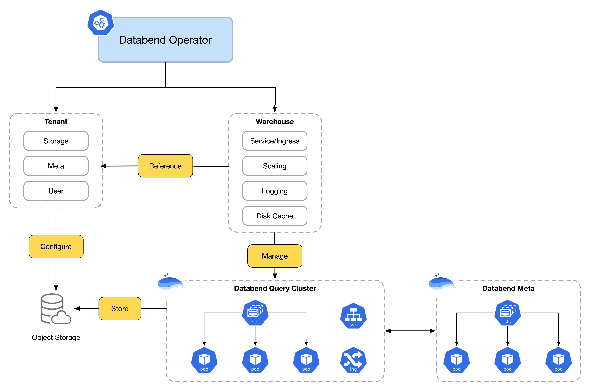

# Databend Operator


<div align="center">

<div>
<a href="https://link.databend.com/join-slack">

</a>

<a href="https://link.databend.com/join-feishu">

</a>

<br>

</div>
</div>

[Kubernetes](https://kubernetes.io/docs/home/) is an open source container orchestration engine for automating deployment, scaling, and management of containerized applications. [Operators](https://kubernetes.io/docs/concepts/extend-kubernetes/operator/) are software extensions to Kubernetes that make use of custom resources to manage applications and their components. Operators follow Kubernetes principles, notably the control loop.

Use this operator to manage [Databend](https://github.com/databendlabs/databend) clusters which are deployed as custom resources. In short, the task of configuring, creating, managing, automatically scaling up and scaling-in of Databend cluster(s) in a Kubernetes environment has been made simple, easy and quick.



## Deploying Operator

Run the following command to install the latest changes of the Databend Operator:

```shell
kubectl apply -k "github.com/databendcloud/databend-operator/manifests"
```

## Get Started

You can get started by deploying [this example](./examples/get-started/) from `examples/get-started`!

Learn more about Databend deployments from [this guide](https://docs.databend.com/guides/deploy/deploy/understanding-deployment-modes).

Step1: Deploy Databend Meta Cluster

```shell
helm repo add databend https://charts.databend.com
helm install meta databend/databend-meta --namespace databend-system
```

Step2: Prepare Object Storage

We'll use [Minio](https://github.com/minio/minio) as the object storage for our example.

```shell
kubectl apply -f "github.com/databendcloud/databend-operator/examples/get-started/minio.yaml"
```

Step3: Define Tenant

```shell
kubectl apply -f "github.com/databendcloud/databend-operator/examples/get-started/tenant.yaml"
```

Step4: Deploy Dataebend Query Cluster(Warehouse)

```shell
kubectl apply -f "github.com/databendcloud/databend-operator/examples/get-started/warehouse.yaml"
```

## License

Copyright 2024.

Licensed under the Apache License, Version 2.0 (the "License");
you may not use this file except in compliance with the License.
You may obtain a copy of the License at

    http://www.apache.org/licenses/LICENSE-2.0

Unless required by applicable law or agreed to in writing, software
distributed under the License is distributed on an "AS IS" BASIS,
WITHOUT WARRANTIES OR CONDITIONS OF ANY KIND, either express or implied.
See the License for the specific language governing permissions and
limitations under the License.

